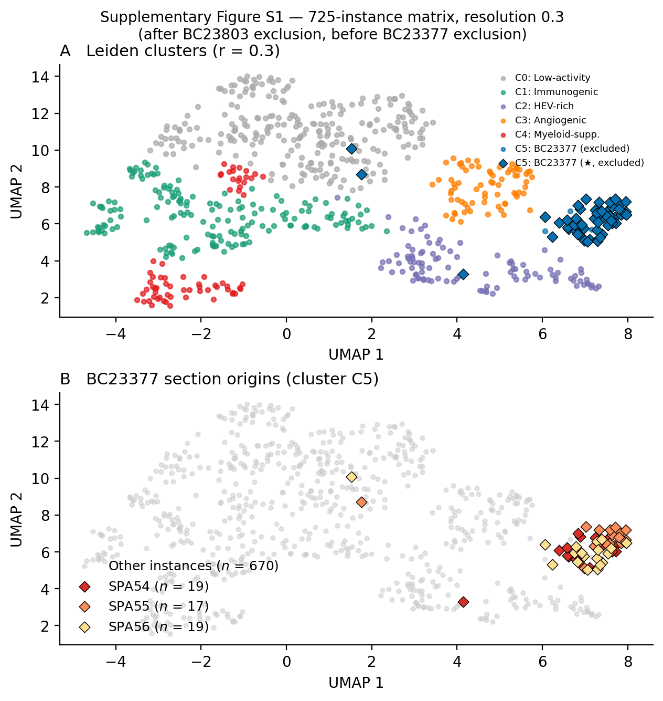
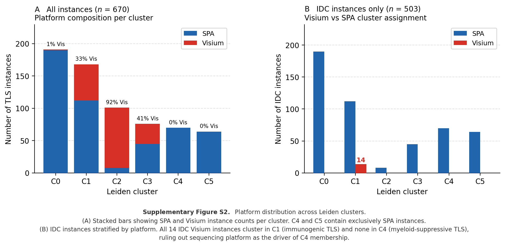

# Introduction

Tertiary lymphoid structures are ectopic lymphoid organs that assemble within chronically
inflamed tissues, including solid tumours [@sautes-fridman2019; @schumacher2022]. Three
landmark 2020 studies established that TLS abundance predicts improved survival and
immunotherapy response across melanoma, sarcoma, and renal cell carcinoma [@cabrita2020;
@helmink2020; @petitprez2020]. However, TLS are not functionally uniform. Mature
immunogenic TLS contain germinal centre (GC) B cells undergoing affinity maturation,
T follicular helper (Tfh) cells, follicular dendritic cells, and high-endothelial venules
(HEV) through which naïve lymphocytes are recruited [@sautes-fridman2019]. Early TLS
represent nascent structures with accumulating lymphocytes but incomplete follicular
organisation. A distinct suppressive phenotype has been described in which regulatory
T cells, tolerogenic macrophages, and TGFβ-producing myeloid cells aggregate within
TLS-like structures, potentially dampening anti-tumour immunity [@joshi2015; @devimarulkar2022].
The clinical impact of TLS therefore depends not on their presence but on their functional 
state --- a distinction that existing profiling methods cannot resolve.

The failure of bulk transcriptomics to distinguish TLS functional states follows directly 
from the spatial organisation of the signals involved. CXCL13, the canonical
Tfh and TLS marker, is co-expressed by exhausted CD8$^+$ T cells throughout the tumour
parenchyma independently of TLS organisation [@dai2020autophagy; @zheng2023].  Bulk CXCL13 therefore 
rises in both productive immunogenic TLS and in CXCL13-high immunosuppressed tumours 
lacking organised lymphoid structures entirely --- the two biological scenarios that most 
urgently need to be distinguished for patient stratification. MS4A1/CD20$^+$ B cells circulate
as tumour-infiltrating B cells independently of TLS organisation, and the myeloid and TGFβ 
signals that define suppressive TLS microenvironments are spatially concentrated in the stroma
surrounding TLS rather than within them, contributing only a small fraction of total tumour 
RNA in bulk assays. Spatial resolution at the level of individual TLS microenvironments is 
therefore required to discriminate organised immunogenic TLS from scattered immune infiltrate.

Spatial transcriptomics, particularly the 10x Visium platform, now provides gene expression
profiles at 55–100 µm resolution across intact tissue sections, enabling direct
characterisation of intact TLS microenvironments [@stahl2016; @moses2022]. However, existing 
ST analytical workflows operate at the spot level, clustering the expression profiles of 
individual capture spots without aggregating the multi-scale spatial context that determines 
TLS function: the combination of in-TLS cellular composition and the composition of the 
immediate microenvironmental niche surrounding each structure. A spot within a germinal centre 
and a spot within a myeloid-infiltrated ring around a suppressed TLS may be spatially adjacent 
and phenotypically similar at the individual spot level, yet belong to fundamentally different 
functional contexts that only become apparent when the entire TLS instance and its 
neighbourhood are considered together.The HEST-1k atlas consolidates 1,276 paired H\&E and 
ST samples from public repositories, covering 25 cancer types and standardising data formats 
across platforms [@jaume2024], creating the opportunity for pan-cancer instance-level TLS 
characterisation at a scale previously unavailable.

We characterise TLS microenvironments at the instance level across 670 TLS instances 
from 113 ST samples spanning 12 cancer types in HEST-1k. HookNet-TLS [@rijthoven2024] 
detects TLS in paired H&E images; co-registered ST spots within each TLS polygon and a 
300 µm microenvironmental ring are aggregated into 12 biologically interpretable features 
combining in-TLS gene module scores with neighbourhood context. Unsupervised Leiden 
clustering resolves six functional states, of which the immunogenic state (C1) independently 
predicts survival in TCGA-BRCA, METABRIC, and TCGA-CESC, and pre-treatment C1 scores predict 
pathological complete response to pembrolizumab in TNBC. The myeloid-suppressive state (C4), 
defined by a spatially concentrated myeloid and TGFβ-high ring surrounding structurally 
mature TLS, shows no survival signal in bulk transcriptomic cohorts, a mechanistically 
anticipated null result that directly demonstrates the information lost at tissue 
homogenisation. A morphological transfer experiment further shows that the ST-derived C1/C4 distinction
is partially recoverable from H&E alone using a spatial graph attention network, 
establishing a pathway toward deployment without transcriptomic infrastructure. 
Together these results demonstrate that TLS functional state is encoded in instance-level 
spatial gene expression profiles --- the combined composition of the TLS and its immediate 
microenvironment --- and not in aggregate marker abundance at any single spot or 
in bulk tissue.

# Methods

## Datasets

**HEST-1k atlas (TLS discovery cohort).** The HEST-1k atlas [@jaume2024] provides 1,276
paired H\&E whole-slide images (WSI) and spatial transcriptomics datasets from public
repositories. Samples were filtered to human cancer tissue with ST data (excluding murine,
non-cancer, and lymph node sections). TLS detection and subsequent analyses were performed
on 246 high-priority samples (Visium and Spatial Transcriptomics platforms), yielding
119 samples with at least one detectable TLS after the cc = 354 confidence threshold (see
below). Six samples were excluded from clustering for single-patient overrepresentation
(see Supplementary Note): SPA51/52/53 (patient BC23803, TNBC, 22 instances dominated by
a patient-specific myeloid phenotype) and SPA54/55/56 (patient BC23377, IDC, 55 instances
that formed a pure patient-specific VEGFA+TGFβ cluster at resolution 0.3). The final
clustering cohort comprised 670 TLS instances from 113 samples spanning 12 cancer types
(IDC, PRAD, EPM, CESC, COAD, PAAD, LUSC, READ, BLCA, SKCM, LUAD, GBM).

**TCGA-BRCA (survival validation).** Gene expression data were obtained from the UCSC
Xena TOIL RSEM repository (log$_2$(TPM+0.001), pan-cancer normalised) [@goldman2020].
Clinical annotations including PAM50 subtype and progression-free interval (PFI) were
downloaded from the Xena survival data portal. After filtering for complete covariate data,
$n$ = 1,211 BRCA patients (927 with full covariate data for Cox regression) with 171 PFI
events were included.

**METABRIC (survival replication).** Gene expression (Illumina HT-12 v3 microarray,
z-scored) and clinical data were obtained from cBioPortal (study: brca\_metabric) via the
REST API [@gao2013]. The full cohort of $n$ = 1,980 patients (1,143 OS events) was used;
PAM50 subtype, age, and Nottingham Prognostic Index (NPI) were used as covariates.

**Shiao et al. 2024 (scRNA-seq immune checkpoint blockade [ICB] dataset).** GSE246613 [@shiao2024] comprises scRNA-seq
profiles from 35 TNBC patients treated with pembrolizumab ± radiotherapy (3 timepoints:
baseline, post-PD-1 blockade, post-RT+PD-1). The h5ad file contains 342,749 immune cells
× 36,601 genes. Pathological complete response (pCR: R/NR) and residual cancer burden
(RCB, 0–3) were embedded in the cell-level metadata. To minimise memory footprint, data
were loaded with `backed='r'` and subset to 22 target genes plus 500 randomly selected
background genes before materialising in memory (peak RAM < 200 MB).

## TLS Detection

H\&E WSIs were preprocessed for HookNet-TLS [@rijthoven2024] using the ASAP pyramidal TIFF 
format at 0.5 µm/px. The HEST TIFFs lack embedded pixel spacing metadata readable by ASAP; 
pixel size was supplied from the HEST metadata field `pixel_size_um_estimated`. Model inference 
was accelerated using PyTorch (CUDA runtime version 12.4) on an NVIDIA GTX 1660 Ti GPU.

TLS polygons were filtered at confidence\_count $\geq$ 354 (minimum area 31,329 µm$^2$,
equivalent to ~200 µm diameter), a threshold grounded in the published minimum TLS size
[@coppola2011]. The original HookNet-TLS upstream default (cc = 147, area ~1,225 µm$^2$)
allowed single-cell clusters to pass; cc = 354 restricts detection to structures at least
consistent with a nascent lymphoid aggregate. Large polygons (area > 1 mm²) were split into sub-instances by watershed segmentation
on the TLS probability heatmap (Gaussian $\sigma$ = 100 µm, minimum inter-centre distance
= 300 µm). Samples from lymph node tissue ($n$ = 52) were excluded, as lymph nodes
constitute organised secondary lymphoid organs rather than ectopic TLS. A further 13
samples sharing WSI slide fingerprints with other samples were flagged as duplicates and
excluded. Instances with at least one co-registered ST spot were retained, yielding 747
TLS instances across 119 samples, of which 670 entered the clustering after the BC23803
and BC23377 exclusions (see Supplementary Note).

ST spots co-registered with each TLS polygon and within a 300 μm microenvironmental ring 
(neighbourhood) were extracted per-instance. For the legacy Spatial Transcriptomics series, original Ensembl IDs were converted to official
HGNC symbols using a BioMart-derived mapping table. All subsequent scoring was performed on
$\log(1+\text{CPM})$-normalised counts; genes absent from a given sample's panel contribute
zero to that sample's module scores.

## Per-Instance Feature Matrix 

Twelve features were computed per TLS instance (Table \ref{tab:features}):

\noindent\textbf{Block 1: In-TLS gene module scores (7 features).} Each score is the
mean `sc.tl.score_genes` value [@wolf2018] over in-TLS spots using the gene sets below.
Spots with zero coverage in any module gene are zero by definition; missing genes absent
from all samples are excluded.

- **GC score**: *BCL6*, *AICDA*, *ELL3*, *MYBL1*, *CXCR4*
- **Tfh score**: *CXCL13*, *CXCR5*, *ICOS*, *IL21*, *TOX2*
- **Plasma score**: *IGHG1*, *IGHG3*, *IGHA1*, *JCHAIN*, *MZB1*
- **HEV score**: *ACKR1*, *SELP*, *CCL21*, *CXCL12* (GLYCAM1 absent from all samples)
- **Suppressive score**: *FOXP3*, *IL2RA*, *CTLA4*, *TGFB1*, *IL10*
- **Myeloid-suppressive score**: *ARG1*, *IL10*, *CD274*, *IDO1*, *MRC1*
- **Cytotoxic score**: *GZMB*, *PRF1*, *IFNG*, *GNLY*, *NKG7*

\noindent\textbf{Block 2: Moran's I spatial autocorrelation.} Eight local Moran's I
statistics (BCL6, AICDA, FOXP3, CXCL13, IGHG1, S100A9, ACKR1, CCL21 per TLS spot) were 
computed but excluded from the final feature set for three reasons: mean values were near 
zero (−0.07 to −0.10), NaN rates were 57–99% (75th percentile of in-TLS spots = 15; spatial 
statistics require $\geq$ 4 neighbours), and within-TLS spatial structure at Visium 100 µm 
resolution is below the scale at which these markers organise.

\noindent\textbf{Block 3: Neighbourhood context scores (5 features).} Computed on spots
in the 300 µm ring outside each TLS:

- **TGFB1 score** (*TGFB1*)
- **VEGFA score** (*VEGFA*)
- **CD8A score** (*CD8A*)
- **Tumour fraction** (mean of *EPCAM*, *KRT8*, *KRT18*, *KRT19*, *CDH1*)
- **Myeloid fraction** (mean of *CD68*, *CSF1R*, *CD14*, *LYZ*, *S100A8*)

## Batch Correction and Feature Scaling

Two scaled variants were produced: (i) per-feature z-score only; (ii) ComBat batch
correction (batch variable: ST technology; Spatial Transcriptomics 200 µm vs Visium 55/100
µm) followed by z-score [@johnson2007]. The correction was assessed by silhouette score in
UMAP space: uncorrected features showed platform silhouette $s$ = 0.166, cancer-type
silhouette $s$ = −0.291; ComBat reduced platform signal ($s$ = 0.024) but worsened the
cancer-type silhouette ($s$ = −0.364). The correction is epistemically weak because the
only within-cancer-type bridge between platforms is 14 IDC Visium samples against 566 IDC
SPA samples; ComBat calibrates the cross-platform shift entirely on this imbalanced anchor,
likely removing real IDC biology. The z-score-only variant was used for all clustering and
downstream analyses. The negative cancer-type silhouette is biologically expected: TLS
functional states cross cancer types, so a cancer-type-driven cluster structure would
indicate platform confound, not biology.

## Leiden Clustering and UMAP

Nearest-neighbour graph construction ($k$ = 15, cosine metric) and Leiden clustering were
performed using `scanpy` [@wolf2018]. Three resolutions were evaluated (0.1, 0.3, 0.5);
cluster stability was assessed by pairwise ARI across 20 random seeds. UMAP embedding was
computed with default parameters for visualisation only (not used for clustering).

Resolution 0.3 was selected as the canonical solution on the basis that it produced the
finest granularity at which the immunogenic cluster (C1) remained coherent: it yielded 6
biologically interpretable clusters (ARI = 0.83 ± 0.14 across 20 seeds, range 0.46–1.00).
At resolution 0.3, instability occurred in two modes: three seeds produced five-cluster solutions through
partial merging of the C0/C4/C5 boundary while leaving C1 intact, and five seeds
over-resolved C1 into two or three subclusters. C1 was recovered as a coherent cluster in
15/20 seeds (purity = 1.00 in those seeds). Resolution 0.1 produced only two clusters
separating immune-hot from immune-cold TME, collapsing the functional diversity captured at
resolution 0.3; resolution 0.5 yielded 9 clusters in which C1 fragmented without
independent biological justification. The UMAP of the 670-instance canonical clustering is
shown in Figure \ref{fig:overview}B.

## Survival Analysis

C1 and C4 gene module scores were computed in TCGA-BRCA and METABRIC as the mean
z-score across the respective gene sets:

\noindent $C1 = $ mean z-score of *CXCL13*, *CCL19*, *CCL21*, *LAMP3*, *ACKR1*, *MS4A1*,
*CXCR5*, *BCL6*, *IGHG1*, *JCHAIN*, *MZB1*, *TNFSF13B*, *AICDA* (13 genes)

\noindent $C4 = $ mean z-score of *TGFB1*, *IL10*, *ARG1*, *MRC1*, *IDO1*, *FOXP3*,
*IL2RA*, *CTLA4*, *CD274* (9 genes)

Genes absent from a platform were excluded from the mean. Kaplan-Meier curves were
computed on top vs bottom quartile stratification. Multivariate Cox proportional hazards
regression included age (continuous), disease stage (categorical), and PAM50 subtype
(dummy-coded, LumA reference) in TCGA; age, NPI (continuous), and PAM50 in METABRIC.
TCGA endpoint: progression-free interval (PFI), selected over overall survival (OS) because
TCGA-BRCA OS has only ~16% event rate due to the good-prognosis demographic; PFI with 171
events captures immune-relevant recurrence. Hazard ratios and 95% confidence intervals are
reported per unit standard deviation of the module score.

## Immunotherapy Response Validation (Shiao et al.)

Counts were normalised to $\log(1+\text{CPM})$ per cell. C1 and C4 scores were computed
per cell using `sc.tl.score_genes` [@wolf2018], which scores each cell as the mean
expression of the target gene set minus the mean of an expression-level-matched control
gene set sampled internally by scanpy. Per-patient
pseudobulk scores were computed as the mean across cells at the baseline timepoint
(pre-treatment). Mann-Whitney U test compared C1/C4 scores between pathological
responders (pCR = R) and non-responders (pCR = NR). Spearman rank correlation between
pseudobulk scores and RCB (0–3, continuous) tested the dose-response relationship.

## Morphological Feature Extraction and Classification

Nine morphological features were extracted from two sources provided by the HEST-1k
dataset, without accessing whole-slide images: (i) TLS polygon coordinates from the
stage 1 HookNet output, and (ii) HEST pre-extracted 224×224 px H&E spot patches
co-registered with ST barcodes. Shape features (log area, circularity, convexity,
elongation) were derived from polygon geometry; elongation is the major/minor axis
ratio of the minimum bounding rectangle. Haematoxylin intensity features were computed
from the spot patches using Ruifrok–Johnston stain deconvolution
(`skimage.color.rgb2hed`, channel 0) in two
spatial regions: Region A (in-TLS spots: he\_mean\_A, he\_var\_A) and Region B (300 µm
ring spots: he\_mean\_B, he\_var\_B, he\_ratio\_BA = B/A ratio). Patch-to-spot assignment
used KD-tree nearest-neighbour matching through the original ST h5ad barcodes
(tolerance 2 µm). Circularity and convexity are undefined for watershed-split
instances ($n$ = 241) and were median-imputed within each training fold.

A Random Forest (500 trees, balanced class weights, scikit-learn) was evaluated under
five pre-specified metrics with patient-level cross-validation. The primary metric,
C1-SPA vs C4 AUROC, used leave-one-C4-patient-out CV (9 folds over 9 C4 patients),
with a round-robin subset of C1-SPA patients held out simultaneously to ensure both
classes appeared in each test fold. The secondary metric (full C1 vs C4) used the
same scheme including C1-Visium instances. Platform confound was quantified by
distinguishing C1-Visium from C1-SPA (5-fold patient CV, label = platform). C1 vs C0
AUROC and 6-class macro F1 used 3-fold patient CV.

## Spatial Graph Neural Network

Each TLS instance was represented as a two-region spatial graph over its HEST spot
patches. Node features were computed by passing each 224×224 px RGB patch through a
ResNet-50 encoder (ImageNet1K-V2 weights, torchvision; avgpool output, 2048-dim),
then reducing to 64-dim by PCA fitted on training instances only per fold. Two
supplementary features were appended per node: a binary region indicator
(0 = TLS interior, 1 = 300 µm ring) and a binary platform indicator (0 = Visium,
1 = SPA), giving 66-dim node features. Edges were constructed as: $k$ = 6 spatial
$k$-nearest-neighbour edges within interior nodes, $k$ = 6 within ring nodes, and
$k$ = 3 cross-boundary edges from each interior node to its nearest ring nodes
(undirected; all directed pairs included).

The graph attention network (GAT; PyTorch Geometric) comprised two message-passing
layers: layer 1 uses 8 attention heads with hidden dimension 64 (concatenated,
512-dim output); layer 2 uses 1 head (mean, 64-dim output). Dropout of 0.3 was applied
to attention weights and between layers. Graph-level representations were formed by
separate mean-pooling over interior nodes and ring nodes, concatenated (128-dim) before
a two-layer MLP head (128→64→1). The model was trained with binary cross-entropy loss,
Adam optimiser (lr = 1×10⁻³, L2 weight decay = 1×10⁻⁴) for 80 epochs per fold.
Training graphs received random rotation and coordinate jitter augmentation (±5% of
coordinate standard deviation) to account for the arbitrary orientation of TLS.
Evaluation used the same LOPO-CV scheme as the Random Forest analysis.

```{=latex}
\begin{table}[h]
\centering
\caption{\textbf{Per-instance feature set.} Block 1: in-TLS gene module scores.
Block 3: 300 µm neighbourhood context. Moran's I (Block 2) excluded (see Methods).}
\label{tab:features}
\small
\begin{tabular}{llp{4.8cm}}
\toprule
Block & Feature & Gene set \\
\midrule
1 & GC score      & BCL6, AICDA, ELL3, MYBL1, CXCR4 \\
1 & Tfh score     & CXCL13, CXCR5, ICOS, IL21, TOX2 \\
1 & Plasma score  & IGHG1, IGHG3, IGHA1, JCHAIN, MZB1 \\
1 & HEV score     & ACKR1, SELP, CCL21, CXCL12 \\
1 & Suppressive   & FOXP3, IL2RA, CTLA4, TGFB1, IL10 \\
1 & Myeloid-supp. & ARG1, IL10, CD274, IDO1, MRC1 \\
1 & Cytotoxic     & GZMB, PRF1, IFNG, GNLY, NKG7 \\
\midrule
3 & Nbr.\ TGFB1  & TGFB1 (ring spots) \\
3 & Nbr.\ VEGFA  & VEGFA (ring spots) \\
3 & Nbr.\ CD8A   & CD8A (ring spots) \\
3 & Tumour frac. & EPCAM, KRT8, KRT18, KRT19, CDH1 \\
3 & Myeloid frac.& CD68, CSF1R, CD14, LYZ, S100A8 \\
\bottomrule
\end{tabular}
\end{table}
```

```{=latex}
\FloatBarrier
```

# Results

## Pan-cancer TLS detection yields 670 instances across 12 cancer types

```{=latex}
\begin{figure*}[t]
\centering
\includegraphics[width=\textwidth]{figures/fig1_overview.png}
\caption{\textbf{Study overview.}
\textit{Left} (A): Full analysis pipeline. Blue boxes: data-processing steps from H\&E WSI
through HookNet-TLS detection, ST extraction, 12-feature matrix construction, and Leiden
clustering (670 instances, 6 clusters). Green boxes: downstream validation steps ---
cross-cohort survival analysis (TCGA-BRCA, METABRIC, TCGA-CESC), immune checkpoint
blockade (ICB) response prediction (pembrolizumab, $n$ = 29 TNBC), and morphological
transfer via spatial graph attention
network (H\&E + GAT, AUROC = 0.857).
\textit{Right} (B): UMAP of 670 TLS instances coloured by Leiden cluster (resolution 0.3).
Six functional states are resolved; cluster sizes range from 64 (C5) to 191 (C0).}
\label{fig:overview}
\end{figure*}
```

HookNet-TLS was applied to all 372 cancer samples in HEST-1k on Visium and Spatial
Transcriptomics platforms (healthy tissue, non-cancer organs, and low-quality samples
were excluded at the outset; Xenium and Visium HD were excluded owing to incompatible
coordinate systems; see Methods). At the cc = 354 confidence threshold,
TLS were detected in 237 samples (64%); after further excluding duplicate slides,
samples with no co-registered ST spots, and samples failing metadata quality checks
(non-human tissue, lymph nodes, and non-cancer annotations), 747 instances across 119
samples remained. After excluding six serial sections from patients BC23803 (SPA51/52/53;
22 instances) and BC23377 (SPA54/55/56; 55 instances) due to single-patient
overrepresentation (see Supplementary Note), 670 instances from 113 samples entered the
functional state analysis. Cancer types represented include IDC (breast invasive ductal
carcinoma; the largest cohort, $n$ = 503 instances), PRAD, CESC, COAD, EPM, PAAD,
LUSC, READ, BLCA, SKCM, GBM, and LUAD (Figure \ref{fig:overview}).

## Leiden clustering resolves six TLS functional states

```{=latex}
\begin{figure*}[t]
\centering
\includegraphics[width=\textwidth]{figures/fig2_clustering.png}
\caption{\textbf{Six TLS functional states from Leiden clustering.}
\textit{Panel A}: Cohort composition --- number of TLS instances per cancer type, coloured
by cluster assignment.
\textit{Panel B}: Feature heatmap (mean z-scored value per cluster). Rows: 12 features;
columns: 6 clusters. C1 shows high Plasma, GC, Tfh, and HEV scores combined with CD8A
neighbourhood enrichment; C4 shows high Myeloid fraction and TGFB1 in the ring; C2 shows
uniformly low values; C3 is defined by neighbourhood VEGFA; C5 by high tumour fraction.
\textit{Panel C}: Cluster size ($n$) and cancer-type composition per cluster.}
\label{fig:clustering}
\end{figure*}
```

Leiden clustering of the 12-feature z-scored matrix at resolution 0.3 produced six clusters
with moderate stability (ARI = 0.83 ± 0.14 across 20 seeds; Figure \ref{fig:clustering}).
Table \ref{tab:clusters} summarises the functional interpretation of each cluster based on
its feature profile. Feature selection was based on established TLS biology prior to any
data analysis; biological validation of cluster assignments relied exclusively on genes
absent from the feature set and on independent clinical cohorts, ensuring that functional
interpretation was not circular with feature construction.

**C0: Low-activity IDC TLS** ($n$ = 191): near-zero on all features; dominated by IDC
SPA instances (190/191). Neighbourhood tumour fraction is modestly elevated (mean z = 0.24),
suggesting proximity to tumour epithelium. This cluster may represent TLS at a
pre-immunogenic stage or under suppressive tumour proximity constraints.

**C1: Immunogenic TLS** ($n$ = 168): highest Plasma score (+1.45), GC score (+0.47), Tfh
score (+0.69), and HEV score; elevated cytotoxic and myeloid-suppressive scores; CD8A
neighbourhood enrichment (+0.74). Cancer-type composition is broadly multi-cancer (IDC 126,
COAD 13, CESC 12, PAAD 7, READ 4, BLCA 3) with genuine platform mixing (112 SPA + 56
Visium). This is the highest-confidence functional class.

**C2: Excluded/peripheral TLS** ($n$ = 101): negative on all features; dominated by PRAD
(48/101) and EPM (32/101), cancer types where TLS appear at tumour margins but lack
tertiary lymphoid organiser cells [@sautes-fridman2019]. Predominantly Visium
platform (93/101).

**C3: VEGFA-angiogenic TLS** ($n$ = 76): high neighbourhood VEGFA (+1.59) and tumour
fraction (+0.31); mixed IDC and PRAD. Consistent with pre-TLS or regressing structures
in VEGFA-high microenvironments where HEV differentiation is suppressed [@motz2013].

**C4: Myeloid-suppressive TLS** ($n$ = 70): high neighbourhood myeloid fraction (+1.62)
and TGFB1 (+0.91); elevated in-TLS suppressive score (+0.66). All 70 instances are IDC
SPA, raising the question of platform confound. However, all 14 IDC Visium instances
assign to C1 (not C4), indicating that the C4 feature profile is not a platform artefact:
a platform effect would pull IDC Visium toward C4, not away from it (\hyperref[fig:s2]{Supplementary Figure S2}).

**C5: Tumour-proximal TLS** ($n$ = 64): high neighbourhood tumour fraction (+0.90) and
moderate myeloid fraction (+0.36); IDC SPA only, 10 samples from 5 patients. These
instances are characterised by proximity to tumour-rich zones rather than by angiogenic
signalling, distinguishing them from C3 (VEGFA-driven) and from the immunogenic core of C1.
TLS at the tumour–stroma interface have been documented across multiple cancer types and
are characterised by greater exposure to tumour-derived myeloid signals compared with TLS
in peripheral stromal regions [@sautes-fridman2019]. The elevated neighbourhood myeloid fraction in C5 (+0.36)
is consistent with this interface location, where both tumour and myeloid cells cohabit the
immediate microenvironment. Whether C5 TLS are functionally suppressed by tumour proximity,
or represent an early-stage immune response at the advancing tumour front, cannot be
resolved from gene expression alone and would require multiplexed spatial proteomics to
assess GC organisation directly.

```{=latex}
\begin{table}[t]
\centering
\caption{\textbf{Leiden cluster summary} (resolution 0.3, $n$ = 670 instances).
Feature values are mean z-scored scores (only top defining features shown per cluster).
Multi-cancer: $\geq$ 3 cancer types represented.}
\label{tab:clusters}
\resizebox{\columnwidth}{!}{%
\begin{tabular}{clcrll}
\toprule
Cluster & Label & $n$ & Multi-cancer & Dominant features \\
\midrule
C0 & Low-activity    & 191 & No (IDC) & Near-zero all; Tumour frac +0.24 \\
C1 & Immunogenic     & 168 & Yes & Plasma +1.45, Tfh +0.69, GC +0.47 \\
C2 & Excluded        & 101 & No (PRAD/EPM) & All features negative \\
C3 & Angiogenic      &  76 & Partial & Nbr.\ VEGFA +1.59 \\
C4 & Myeloid-supp.   &  70 & No (IDC) & Nbr.\ Myeloid +1.62, TGFB1 +0.91 \\
C5 & Tumour-proximal &  64 & No (IDC) & Nbr.\ Tumour frac +0.90 \\
\bottomrule
\end{tabular}%
}
\end{table}
```

TLS polygon area varied significantly across functional states (Kruskal-Wallis $H$ = 93.7, $p$ = 1.1 × 10⁻¹⁸). The myeloid-suppressive cluster C4 comprised the largest TLS (mean log area 13.09 ± 0.83 µm²), approximately 3× larger in raw area than the immunogenic C1 (12.00 ± 0.90; Mann-Whitney $p_{\text{adj}}$ < 10⁻¹², Bonferroni-corrected). To exclude platform-driven polygon inflation, we compared C4 against C1 instances on the same SPA platform (C4 is SPA-only): within-C1 SPA versus Visium instances are statistically identical in size (mean log area 12.007 vs 11.980, $t$ = 0.18, $p$ = 0.86, Cohen $d$ = 0.029), confirming that the C4 size difference reflects biology not polygon measurement artefact (C4 SPA vs C1 SPA: Cohen $d$ = 1.25). This suggests myeloid suppression acts on structurally mature TLS rather than nascent aggregates: the immune architecture is established but the surrounding myeloid niche is actively antagonising it, a more concerning biological scenario than C4 representing simply undeveloped structures. By contrast, the immunogenic (C1) and low-activity (C0, 12.21 ± 0.95) clusters were statistically indistinguishable in size ($p_{\text{adj}}$ = 0.41), indicating that functional divergence between these states is driven by in-TLS composition and microenvironmental context, not structural maturation.

Log area was tested as a 13th clustering feature but excluded from the canonical feature set: its inclusion dissolved the tumour-proximal C5 cluster into C0 (ARI vs 12-feature solution = 0.81), because C5 and C0 overlap substantially in size but are distinguished by neighbourhood tumour fraction. The 12-feature set therefore captures a biologically relevant distinction that size alone does not resolve.

## C1 enriches canonical TLS organisers absent from the feature set

```{=latex}
\begin{figure}[!htbp]
\centering
\includegraphics[width=\columnwidth]{figures/fig3_coherence.png}
\caption{\textbf{Internal biological coherence of C1.}
Expression of canonical TLS organiser genes not included in the 12-feature set, compared
between C1 and all other clusters (log$_2$ fold change; unpaired $t$-test).
\textit{CR2} (CD21, follicular dendritic cell marker), \textit{LTA} (lymphotoxin-α,
required for B cell zone formation), and \textit{MS4A1}/CD20 (mature B cell marker) are
all strongly enriched in C1. These genes were not part of any feature used in clustering,
providing independent biological validation of the C1 immunogenic label.}
\label{fig:coherence}
\end{figure}
```

To validate that the C1 cluster label reflects genuine immunogenic TLS biology rather than
a statistical artefact of the feature set, we tested expression of canonical TLS organiser
genes not present in any of the 12 clustering features, ensuring that validation was not
circular with feature construction.

In-TLS spots from C1 instances showed markedly elevated expression of *IGHD* (21.8× above
cohort mean), *CR2*/CD21 (9.4×), lymphotoxin-alpha (*LTA*, 6.0×), *MS4A1*/CD20 (4.0×),
and *TNFSF13B*/BAFF (4.0×). *IGHD* encodes the IgD heavy chain constant region and is
selectively expressed by naive and transitional B cells that have not yet undergone class
switching; its strong enrichment in C1 reflects continuous recruitment of naive B cell
precursors into active GC reactions, consistent with the high Plasma_score (class-switched
output: IGHG1, MZB1) in the same cluster. Together, *IGHD* and Plasma_score mark both the
input and output arms of the GC reaction simultaneously, a hallmark of productive ongoing
germinal centre activity [@gitlin2014]. *CR2*/CD21 marks follicular dendritic cells critical
for antigen presentation within the GC, *LTA* (lymphotoxin-alpha) is required for B cell
zone organisation and HEV maintenance [@drayton2006], and *MS4A1*/CD20 marks mature B
cells. None of these five genes appear in the 12 clustering features. The concordant
enrichment across four mechanistically distinct compartments (naive B cell input, GC
structural organisation, lymphotoxin signalling, and mature B cell content) provides
independent biological validation of the C1 immunogenic state label (Figure \ref{fig:coherence}).

## C1 independently predicts survival across three bulk transcriptomic cohorts

```{=latex}
\begin{figure*}[t]
\centering
\includegraphics[width=\textwidth]{figures/fig4_survival.png}
\caption{\textbf{C1 predicts survival in TCGA-BRCA, METABRIC, and TCGA-CESC.}
Red: high C1 (top quartile); blue: low C1 (bottom quartile). High-C1 patients showed
significantly better survival in all three cohorts.
\textit{Top left}: Kaplan-Meier curves for TCGA-BRCA progression-free interval (PFI)
($n$ = 1,211; log-rank $p$ = 0.0015).
\textit{Top right}: METABRIC overall survival ($n$ = 1,980; log-rank $p \approx 0$).
\textit{Bottom left}: TCGA-CESC overall survival ($n$ = 304; log-rank shown).
\textit{Bottom right}: Forest plot of multivariate Cox HR for C1 and C4 across all three
cohorts. C1 is independently protective in all three; C4 is null in breast cancer cohorts.
Error bars: 95\% CI.}
\label{fig:survival}
\end{figure*}
```

To test whether the immunogenic TLS state identified from ST correlates with clinical
outcome in bulk transcriptomic datasets, we computed the C1 gene module score in
TCGA-BRCA ($n$ = 1,211), METABRIC ($n$ = 1,980), and TCGA-CESC ($n$ = 304).

**TCGA-BRCA.** Kaplan-Meier analysis by top vs bottom quartile C1 score showed
significantly better PFI for high-C1 patients (log-rank $p$ = 0.0015; Figure
\ref{fig:survival}). In multivariate Cox regression adjusted for age, stage, and PAM50
subtype (reference LumA, $n$ = 927), C1 was independently protective (HR = 0.915
[0.844–0.992], $p$ = 0.031). The C4 suppressive module showed no association (HR = 0.996
[0.886–1.121], $p$ = 0.953). PAM50-stratified analysis revealed that the C1 survival
benefit was most pronounced in Luminal B tumours (log-rank $p$ = 0.013), which do not
currently receive checkpoint therapy as standard of care.

**METABRIC.** The C1 effect replicated with an attenuated but statistically robust signal
(Cox HR = 0.855 [0.770–0.948], $p$ = 0.003, adjusted for age, NPI, and PAM50). The C4
module was again null (HR = 1.000 [0.876–1.141], $p$ = 0.999). The C1 Luminal B
association from TCGA was not replicated in METABRIC (log-rank $p$ = 0.302), potentially
reflecting PAM50 misclassification on the older Agilent array platform and treatment-era
differences (METABRIC 2000–2010 pre-dates checkpoint therapy).

**TCGA-CESC.** To test generalisability beyond breast cancer, we applied the same C1
module to TCGA cervical squamous cell carcinoma, a cancer type represented in our HEST
cohort (12 ST instances, predominantly in C1 and C2). C1 was independently protective
(Cox HR = 0.562 [0.345–0.918], $p$ = 0.021, adjusted for age, $n$ = 304, 72 OS events),
consistent with the established role of TLS-organised immune responses in HPV-driven
tumours [@sautes-fridman2019]. The C4 module showed a borderline association in CESC
(HR = 0.589, $p$ = 0.036); unlike BRCA, the individual C4 genes (PD-L1/CD274, IDO1,
FOXP3) are co-expressed with productive anti-tumour immunity in HPV+ cervical cancer
[@schumacher2022], so the bulk signal in CESC likely reflects general immune activation rather
than the myeloid ring suppression that defines C4 spatially.

The null result for C4 in bulk cohorts reflects two compounding factors absent from the 
C1 case. First, C4's defining signal is spatially relative: the relevant biological feature 
is myeloid cell concentration specifically in the 300 µm ring surrounding TLS, not myeloid 
cell abundance per se. Bulk RNA-seq destroys this spatial reference entirely: a tumour 
with myeloid cells concentrated around TLS and one with the same cells diffusely distributed 
are indistinguishable. Second, the cell types carrying C4's marker genes (myeloid cells 
expressing ARG1, MRC1, IDO1) are distributed throughout tumours regardless of TLS organisation, 
producing high background expression that masks any TLS-proximal enrichment signal. 
By contrast, C1's marker genes are expressed by cell types --- plasma cells, GC B cells, 
Tfh cells --- that are rare outside organised TLS, so their bulk abundance remains informative 
about TLS composition even after spatial context is lost.

The C1 survival module captures only the gene expression component of cluster C1: 
the in-TLS cell-type composition encoded in Block 1 features, while the spatial neighbourhood 
context that contributed to C1 cluster assignment (Block 3, including CD8A neighbourhood enrichment) 
is absent from bulk data entirely. That a partial projection of the C1 signal onto bulk-measurable 
genes produces significant and replicable survival associations across three independent cohorts 
suggests that the full instance-level spatial signal, were it directly measurable in clinical samples, 
would provide at least equivalent and potentially stronger prognostic resolution.


## Pre-treatment C1 score predicts pembrolizumab response in TNBC

```{=latex}
\begin{figure}[!htbp]
\centering
\includegraphics[width=\columnwidth]{figures/fig5_shiao.png}
\caption{\textbf{C1 score predicts ICB response in Shiao et al. 2024 (GSE246613).}
\textit{Left}: Pre-treatment C1 pseudobulk score in responders (R, pCR achieved, $n$ = 24)
vs non-responders (NR, $n$ = 10) at baseline (Mann-Whitney $p$ = 0.030).
\textit{Right}: C1 score vs residual cancer burden (RCB, 0–3; Spearman $\rho$ = −0.384,
$p$ = 0.040; $n$ = 34). Higher C1 → less residual disease after pembrolizumab therapy.
The relationship is continuous, consistent with a dose-response between C1 immune
activation state and depth of treatment response.}
\label{fig:shiao}
\end{figure}
```

To ask whether the C1 state defined from ST predicts pre-treatment immune readiness for
checkpoint blockade, we scored TNBC biopsies from the Shiao et al. 2024 pembrolizumab ±
radiotherapy trial [@shiao2024] using the C1 and C4 gene modules.

Pre-treatment C1 pseudobulk scores were significantly higher in patients achieving pCR
than in non-responders (R median = +0.142, NR median = −0.038, Mann-Whitney $p$ = 0.030;
$n$ = 34 baseline samples with known pCR: R = 24, NR = 10; Figure \ref{fig:shiao}).
Continuous C1 scores showed a dose-response relationship with RCB: Spearman $\rho$ = −0.384
($p$ = 0.040), meaning higher pre-treatment C1 signal corresponds to less residual disease
after treatment. The C4 suppressive module was borderline on pCR (Mann-Whitney $p$ = 0.047)
but null for the continuous RCB endpoint ($\rho$ = −0.177, $p$ = 0.358).

This result is prospective-adjacent: the C1 score is measured in pre-treatment biopsies
and tested against post-treatment pathological outcomes. Unlike post-hoc survival
associations, it measures the state of the immune microenvironment before any therapeutic
perturbation, more directly testing whether the immunogenic TLS state represents genuine
functional immunity rather than an epiphenomenon of tumour biology.

## C4 is a spatial microenvironmental state invisible to bulk transcriptomics

The myeloid-suppressive cluster C4 is characterised by features that are inherently
spatial: an elevated myeloid fraction and TGFβ signal in the 300 µm ring surrounding each
TLS, not within it. This microenvironmental configuration, in which myeloid cells
concentrate around rather than inside TLS and secrete TGFβ, is consistent with a
mechanism of extrinsic suppression of TLS function described by Sautes-Fridman et al. [@sautes-fridman2019]
and Bugatti et al. [@bugatti2022]. The myeloid infiltrate constitutes a small fraction of
total tumour cellularity; its spatial concentration around TLS does not produce a
detectable signal in bulk tumour RNA-seq.

To assess whether C4 reflects patient-level immune microenvironment rather than
instance-level stochasticity, we decomposed variance in the two defining C4 features
across the five patients contributing instances to this cluster. Neighbourhood myeloid
fraction variance was predominantly between-patient (81.8% between vs 18.2% within),
indicating that myeloid enrichment around TLS is a consistent characteristic of a
patient's tumour microenvironment rather than spatially heterogeneous within a patient.
Neighbourhood TGFB1 was less patient-consistent (57.6% between-patient), suggesting
spatial variation in TGFβ secretion within individual tumours. BC23288 ($n$ = 21 instances)
showed consistently lower myeloid enrichment (mean z = +0.88) than the remaining four
patients (mean z = 1.70–1.96), indicating graded rather than binary myeloid suppression
across C4 patients. This patient-level structure supports therapeutic stratification based
on the myeloid microenvironment rather than TLS-level biomarker readouts.

The large physical size of C4 instances (approximately 3× the area of C1, $p$ < 10⁻¹²)
indicates that myeloid suppression is not a feature of immature or nascent TLS but of
structurally developed lymphoid structures whose functional output has been redirected by
the surrounding myeloid niche. This distinguishes C4 from a simple failure of TLS
maturation and implies that therapeutic targeting of C4 would require disrupting an
established suppressive microenvironment rather than promoting TLS development.

The null result for C4 in TCGA-BRCA and METABRIC is therefore mechanistically interpretable,
not a failure of the cluster. Validating C4's biological reality requires assays that
preserve spatial context: multiplexed immunofluorescence, spatial proteomics (CODEX), or
ST at single-cell resolution. The Shiao et al. CODEX companion data (not analysed here)
would provide a direct test of myeloid ring enrichment in C4-predicted TLS.

## H\&E morphological features discriminate C4 from immunogenic TLS

To determine whether the ST-derived C1/C4 distinction is recoverable from routine
histology, nine morphological features were extracted per instance---four polygon shape
descriptors and five haematoxylin intensity statistics from the TLS interior and the
300 µm ring---and a Random Forest classifier was evaluated with patient-level cross-validation
(see Methods).

The primary metric, C1-SPA vs C4 AUROC within the SPA platform ($n$ = 182), was 0.744
(9-fold LOPO-CV, range [0.00, 1.00]). The wide per-fold range reflects three single-instance
C4 patients (SPA100, SPA66, SPA90) whose individual test folds reduce to a single-positive
ranking problem; restricting to the six patients with $\geq$ 3 C4 test instances yields
AUROC = 0.902 [0.690, 1.000]. As both C1-SPA and C4 reside on the SPA platform, platform
technology cannot explain this discriminability. The within-C1 platform AUROC (C1-Visium
vs C1-SPA, 5-fold patient CV) was 0.866, confirming that H\&E features do carry platform
signal; however, this signal is absent from the within-SPA primary comparison.

The top predictive feature was haematoxylin intensity in the 300 µm ring (he\_mean\_B;
importance 0.276), followed by elongation (0.225) and log area (0.133). The ring-to-interior
ratio he\_ratio\_BA ranked last (0.032), indicating that the C4 ring signal reflects absolute
nuclear density elevation in the neighbourhood rather than a differential ring/interior
contrast. The full C1 vs C4 AUROC (including C1-Visium, $n$ = 238) was 0.855 but
is inflated by platform discrimination rather than biology: the platform confound AUROC
(0.866) exceeds it. The C1 vs C0 AUROC was 0.678; as C0 is 190/191 SPA while C1 contains
56 Visium instances, this comparison is partially platform-driven and cannot be interpreted
as biological. That H\&E morphology cannot distinguish immunogenic from inactive TLS is the
expected result and a necessary internal control: it confirms that the ST-derived cluster
labels capture information that is not visible in unaided histology. Six-class macro F1
across all 670 instances was 0.349 (3-fold patient CV).

The primary AUROC of 0.744 exceeds the pre-specified 0.70 threshold; the spatial GAT analysis is reported in the following section.

## Spatial graph attention improves C4 discrimination over aggregate morphological features

To determine whether spatial patch organisation adds discriminative power beyond aggregate
morphological statistics, a graph attention network (GAT) was trained on per-instance
two-region spatial graphs constructed from ResNet-50 patch embeddings (see Methods).

The primary C1-SPA vs C4 AUROC was 0.857 (9-fold LOPO-CV, range [0.533, 1.000]),
representing a +0.113 improvement over the Random Forest baseline (0.744).
Restricting to the six patients with $\geq$ 3 C4 test instances, the GAT achieved
AUROC = 0.922 [0.533, 1.000] versus 0.902 [0.690, 1.000] for the RF --- a more modest
+0.020 gain among reliable folds. The single-instance C4 patients (SPA100, SPA66,
SPA90) improved substantially in the GAT (0.938, 0.625, 0.615) relative to the RF
(0.438, 0.000, 0.846), suggesting that patch-level spatial features generalise better
than aggregate haematoxylin statistics to patients with few training examples. One
patient (SPA103, $n$ = 14 C4 instances) dropped to AUROC = 0.533, indicating
patient-specific morphological variation that the model trained without this patient
does not capture; this represents the lower bound of performance under the LOPO-CV
design and motivates further independent validation.

The primary GAT AUROC of 0.857 exceeds the implementation-note threshold of 0.75 for
reporting as a primary result. Since the within-SPA platform confound AUROC was 0.866
(C1-Visium vs C1-SPA), the GAT primary AUROC is statistically comparable
to the platform signal ceiling --- spatial patch organisation alone does not confidently
exceed the platform-discriminability threshold. The result should therefore be
interpreted as proof-of-concept that ST-derived TLS functional states have a
spatially-structured H\&E correlate, rather than as a deployment-ready classifier.

# Discussion

We present a framework for characterising TLS functional states from routine ST data
at the instance level. Applied to 670 TLS instances across 12 cancer types in HEST-1k,
the approach resolves six functional states whose biological interpretations are
independently supported by genes outside the feature set (C1 coherence), by multi-cohort
bulk transcriptomic survival associations (TCGA and METABRIC), and by pre-treatment ICB
response in an scRNA-seq trial cohort (Shiao et al.).

The central methodological contribution is the aggregation from spot to instance level.
Spot-level clustering discards the cellular composition of an individual TLS and its
microenvironmental context; neither the in-TLS cell-type balance (immunogenic vs
regulatory) nor the surrounding stromal and myeloid landscape can be read from any single
spot. By averaging across all spots within a TLS and its 300 µm ring, we recover
biologically interpretable signals that are washed out at the spot level and lost entirely
in bulk assays. The five neighbourhood features (Block 3) capture TLS microenvironment
rather than TLS composition; without them, C4 and C0 would be indistinguishable.

The C4 null result in TCGA and METABRIC has direct implications for biomarker development.
Studies that search bulk transcriptomic data for a TLS suppressive signal risk concluding
that suppressive TLS do not exist or are not clinically relevant when the signal is simply
undetectable from bulk data. The correct conclusion, supported by our data, is that
myeloid-suppressive TLS represent a spatially specific biological phenomenon that requires
spatial assays for detection and will likely require spatial or cellular resolution for
therapeutic targeting.

The bulk survival validation of C1 is necessarily partial: the 13-gene module approximates 
the transcriptional component of cluster identity but discards the spatial neighbourhood 
context that jointly defined the cluster. Significant survival associations from this partial 
signal imply that the full spatial characterisation represents an underexploited dimension of 
TLS-associated clinical information --- one that will only become accessible as spatial 
transcriptomics enters routine clinical profiling. Conversely, the complete failure of the C4 
bulk module to predict survival despite the cluster's biological coherence demonstrates that 
some functional states are encoded entirely in spatial relationships with no transcriptional 
projection onto bulk-measurable quantities. These two outcomes together --- partial bulk detectability 
of C1, complete bulk invisibility of C4 --- constitute the strongest possible empirical argument 
for spatial transcriptomics as a necessary rather than merely convenient instrument for 
TLS functional characterisation.

The morphological transfer experiment provides a direct test of whether the
ST-derived functional states encode information that is latent in H\&E histology. The
Random Forest aggregate result (AUROC = 0.744) demonstrates that haematoxylin intensity
in the 300 µm ring and polygon size alone carry a biology-driven signal, confirming that
C4's defining features --- elevated myeloid nuclear density in the neighbourhood ring and
larger structural size --- have H\&E-visible consequences. The GAT improvement to 0.857
shows that spatial patch organisation adds discriminative power beyond aggregate statistics,
consistent with the mechanistic hypothesis that myeloid suppression operates through a
spatially concentrated ring of infiltrating cells rather than a diffuse increase. That
the GAT AUROC approaches but does not exceed the platform-discriminability ceiling (0.866)
means the current single-platform cohort cannot definitively separate biology from
platform signal; independent validation on a non-SPA cohort is required to confirm
whether the classifier generalises beyond SPA-specific morphological characteristics.

The C1 Luminal B finding (TCGA $p$ = 0.013) warrants attention: Luminal B breast cancer
does not currently receive PD-1 checkpoint therapy as first-line treatment, yet shows
significant TLS-associated survival benefit. This may indicate a subset of Luminal B
patients with TLS-organised immune microenvironments who are biologically eligible for
checkpoint therapy but are not currently selected for it. Prospective validation with
spatial biopsy analysis would be required before any clinical translation.

**Limitations.** The dominant cohort (IDC SPA) contributes 489 of 670 instances across
26 patients (after excluding BC23803 and BC23377), creating a patient-level imbalance
despite the breadth of cancer types. C4 and C5 are IDC/SPA-exclusive; their functional
interpretation cannot currently be verified in independent platforms. The myeloid-suppressive
interpretation of C4 is supported within IDC but requires cancer-type-specific validation
before generalising: in CESC, C4 marker genes co-express with productive anti-tumour immunity,
suggesting the spatial myeloid ring may have different functional consequences in HPV-driven tumours. The TLS detection threshold
(cc = 354) calibrates to ~200 µm minimum diameter, appropriate for mature TLS but likely
excluding small nascent structures in Visium samples where coverage density at the TLS
border is lower. The survival validation relies on proxy gene signatures in bulk data
rather than direct ST measurement of TLS state, introducing a layer of abstraction. The
morphological transfer experiment achieves proof-of-concept recoverability
of C4 from H\&E: a GAT on spatial patch graphs achieves primary AUROC = 0.857 (LOPO-CV,
C1-SPA vs C4), improving over a Random Forest baseline (0.744). However, H\&E features
discriminate SPA from Visium platform within C1 at AUROC = 0.866, meaning the GAT
primary result is not confidently above the platform-discriminability ceiling; independent
validation on a non-SPA cohort is required before clinical deployment. One C4 patient
(SPA103, $n$ = 14 instances) scored near chance (AUROC = 0.533) under LOPO-CV,
indicating patient-level morphological heterogeneity that warrants investigation with
larger patient numbers.

**Conclusions.** TLS functional state is encoded in instance-level spatial gene expression
profiles (the combined composition of the TLS and its immediate microenvironment), not
in aggregate marker abundance at any single spot or in bulk tissue. The immunogenic state
(C1) is robustly detectable as a proxy gene signature in bulk transcriptomics and
predicts both survival and checkpoint response; the myeloid-suppressive state (C4) is
a spatial microenvironmental phenomenon that bulk assays cannot capture. This functional
distinction has direct consequences for patient stratification: bulk TLS signatures should
be interpreted as measuring the immunogenic pole of the TLS functional spectrum; patients
in the myeloid-suppressive state would be misclassified as TLS-negative by bulk analysis.
Spatial transcriptomics at the TLS instance level provides the resolution required to
distinguish these states. The ST-derived labels further supervise a morphological
transfer experiment in which a graph attention network trained on H\&E patch embeddings
achieves AUROC = 0.857 for C4 vs C1 within the SPA platform, demonstrating that
the functional distinction has a spatially-structured histological correlate and
establishing a pathway toward deployment in routine diagnostic settings that lack
spatial transcriptomics.

# Data and Code Availability

HEST-1k atlas data are available from the HEST repository [@jaume2024]. TCGA-BRCA
expression and clinical data are available from the UCSC Xena portal [@goldman2020].
METABRIC data are available from cBioPortal [@gao2013]. Shiao et al. scRNA-seq data
are available from GEO (accession GSE246613). All analysis code, processed feature
matrices, and cluster assignments are available at
\url{https://github.com/gavin-peng/tls_hest_functional}.

# Acknowledgements

The author thanks the developers of HEST-1k, HookNet-TLS, and scanpy for providing open
computational infrastructure that made this analysis tractable.

# Author Contributions

G.P. conceived the study, developed the computational pipeline, performed all analyses,
and wrote the manuscript.

# Supplementary Note: Single-Patient Exclusions (BC23803 and BC23377)

Two patients were excluded from the primary clustering analysis due to severe
single-patient overrepresentation that produced artefactual pure-patient clusters.

**BC23803 (SPA51/52/53).** Patient BC23803 (TNBC) contributed three serial sections
(SPA51, SPA52, SPA53) yielding 22 of the raw 747 TLS instances. The feature profile was
dominated by a Neighbor\_myeloid\_fraction score of +2.06 (cohort mean +0.13), consistent
with TNBC's known high myeloid infiltration. At resolution 0.3 on the full 747-instance
matrix, these 22 instances formed a pure patient-specific cluster. After exclusion,
the remaining 725 instances produced 6 biologically interpretable clusters (ARI = 0.91 ± 0.11, 20 seeds).

**BC23377 (SPA54/55/56).** Patient BC23377 (IDC, Luminal B) contributed three serial
sections (SPA54, SPA55, SPA56) yielding 55 of 747 raw instances. At resolution 0.3 on
the 725-instance (post-BC23803) matrix, 53 of the 56 original C5 instances (old canonical)
originated from BC23377, defining a cluster characterised by VEGFA (+0.91) and TGFB1
(+0.42) signals. The cluster failed the biological distinctiveness criterion: its feature
profile was indistinguishable from what would be expected from a single LumB IDC patient's
biology amplified by 55 near-identical section counts. After exclusion, the final
670-instance matrix yields 6 biologically interpretable clusters (ARI = 0.83 ± 0.14 across 20 seeds). The new C5
(tumour-proximal, $n$ = 64) arises from 5 distinct patients with a coherent and
interpretable feature profile (high neighbourhood tumour fraction), confirming it
represents a real biological state rather than an overrepresentation artefact.

Both exclusions follow the same principled criterion: a single patient contributing
$\geq$ 50% of a resolved cluster at the canonical resolution, where the remaining
instances after removal do not reconstitute a biologically coherent group. The excluded
phenotypes (high myeloid IDC and VEGFA+TGFβ IDC) are biologically real but require
patient-stratified analysis and independent replication that is outside the scope of
this work.

# Supplementary Figures

**Supplementary Figure S1.** UMAP of the 725-instance matrix (after BC23803 exclusion,
before BC23377 exclusion), Leiden resolution 0.3.
(A) Instances coloured by cluster. Cluster C5 ($n$ = 56) forms an isolated lobe
in the lower right of the embedding.
(B) BC23377 section origins (SPA54, SPA55, SPA56) highlighted among all instances;
53 of 55 BC23377 instances occupy cluster C5, confirming the cluster is patient-specific
rather than biologically distinct.
{width=100%}

\phantomsection\label{fig:s2}

**Supplementary Figure S2.** Platform distribution across Leiden clusters.
(A) Stacked bars showing SPA and Visium instance counts per cluster across all 670 instances.
C4 and C5 contain exclusively SPA instances (0% Visium).
(B) IDC instances ($n$ = 503) stratified by platform. All 14 IDC Visium instances cluster
in C1 (immunogenic TLS) and none in C4 (myeloid-suppressive TLS), ruling out sequencing
platform as the driver of C4 cluster membership.
{width=100%}
